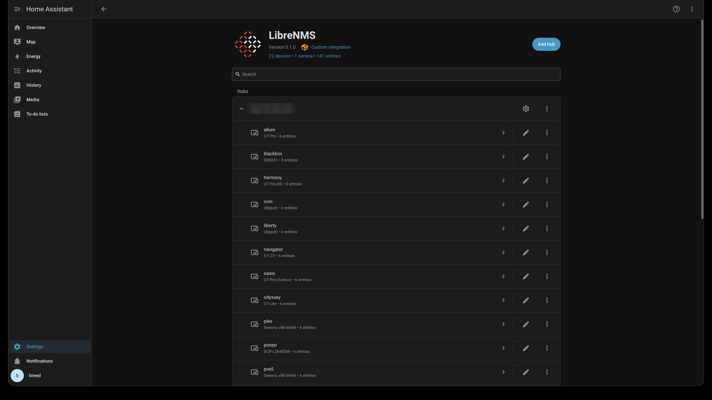
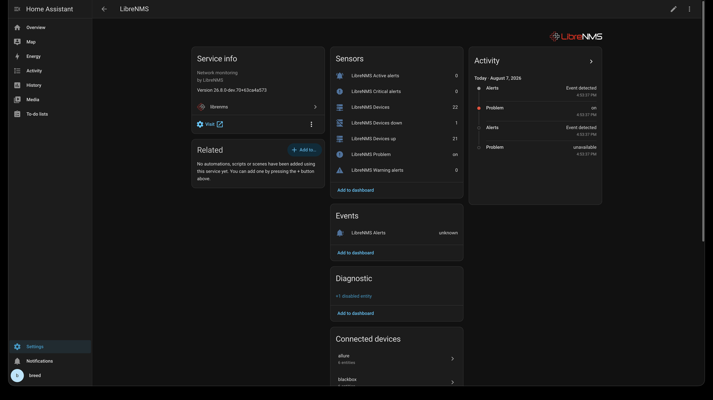
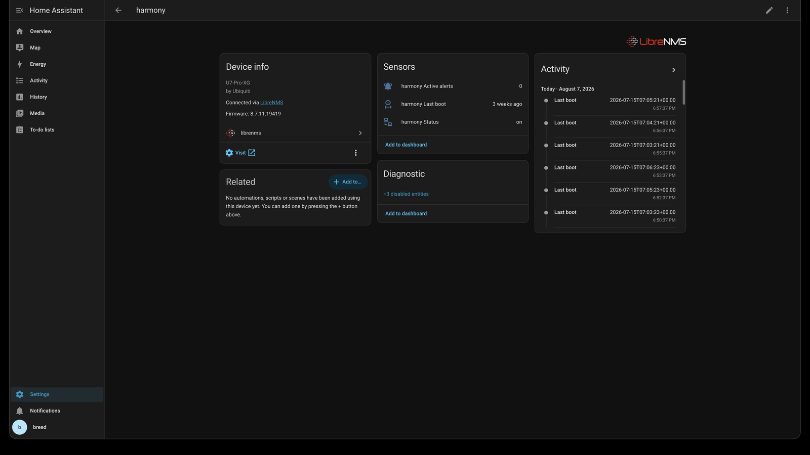
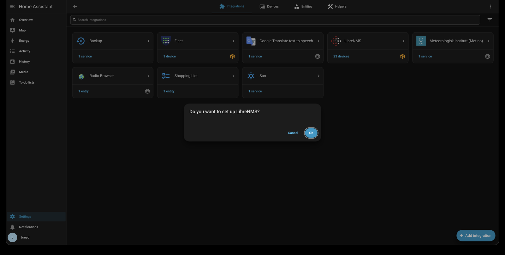

# LibreNMS for Home Assistant

[](https://github.com/breed007/ha-librenms/actions/workflows/tests.yml)
[](https://github.com/breed007/ha-librenms/actions/workflows/validate.yml)
[](https://hacs.xyz)

See your monitored network inside Home Assistant (device up/down, active
alerts, health readings) and automate on it.

This is a read-only integration against the [LibreNMS REST
API](https://docs.librenms.org/API/). It polls your instance and turns every
monitored device into a Home Assistant device, with instance-wide summary
sensors for dashboards and an event entity for alert-driven automations. It
does not modify anything in LibreNMS.

A community project. Not affiliated with, endorsed by, or supported by the
LibreNMS project.

---

## Screenshots

Every device LibreNMS monitors becomes a Home Assistant device, grouped under
a hub for the instance.



The hub holds the instance summary: device counts, active alerts broken down
by severity, the problem binary sensor, and the alert event entity.



Each monitored device gets its own page. Model and vendor come from LibreNMS,
and every device links back to its page there.



Setup is a URL and an API token. No YAML.



---

## Requirements

- Home Assistant **2026.8.0** or newer
- A reachable LibreNMS instance with the API enabled
- A LibreNMS API token

### Supported LibreNMS versions

Version 0.2.0 ran against a live 22-device install of LibreNMS **26.8**. The
changes in 0.3.0 were checked against LibreNMS's source code and this
project's test suite, not against a live instance. The integration uses four
endpoints: `/api/v0/system`, `/api/v0/devices`, `/api/v0/alerts` and
`/api/v0/resources/sensors`. Releases older than 26.8 have not been tested,
and how API tokens are created and accepted changed twice in 2026 (see the
token steps below).

A hard minimum version has not been pinned. If you hit a problem on an older
release, please open an issue with your LibreNMS version so it can be
documented.

---

## Installation

### HACS (custom repository)

1. In Home Assistant, go to **HACS → Integrations**.
2. Open the ⋮ menu → **Custom repositories**.
3. Add `https://github.com/breed007/ha-librenms` with category **Integration**.
4. Find **LibreNMS** in the list, install it, and restart Home Assistant.

### Manual

Copy `custom_components/librenms/` into your Home Assistant `config/custom_components/`
directory and restart.

---

## Setting up the LibreNMS API token

**Create a dedicated user for Home Assistant with the Global Read role.** A
LibreNMS API token has the permissions of the user it belongs to. Global Read
can see every device, alert and health sensor and cannot change anything,
which is what this integration needs.

Two roles to avoid:

- **Normal User** sees only the devices assigned to it, directly or through
  a device group, which on most installs is none. The integration would then
  show no devices at all.
- **Admin** works, but this integration never writes to LibreNMS, and an admin
  token in a leaked Home Assistant backup is admin access to your monitoring
  system.

The LibreNMS API returns alerts for every device, whichever devices the
token's role can see. Alerts on devices the token cannot see are therefore
left out of the alert counts and logged once, which keeps the counts
consistent with the devices Home Assistant shows.

### Which steps to follow

LibreNMS changed how API tokens are created twice in 2026, so the steps
depend on your LibreNMS version. The version is shown on the About page
(`/about` on your LibreNMS address).

| LibreNMS version | Create the token |
|---|---|
| 26.9.0 or later | [On the server](#on-the-server-librenms-2690-or-later) (simplest), or [on the token page](#on-the-token-page-librenms-2640-or-later) |
| 26.4.0 to 26.8.x | [On the token page](#on-the-token-page-librenms-2640-or-later) |
| Older than 26.4.0 | [As an admin](#as-an-admin-librenms-older-than-2640) |

On 26.4.0 or later, if LibreNMS signs users in through LDAP or Active
Directory, use the server method, which needs 26.9.0 or later. The token
page only works with LibreNMS's own user database; see the note at the end
of that section.

The steps name pages by their address, such as `/users`: add it to the
address of your LibreNMS, as in `https://librenms.example.com/users`.
Menu labels have changed between versions; these addresses have not.

### Step 1: create the user

As an admin, open `/users` (**Manage Users** in the gear menu) and add a
user, for example `homeassistant`, with the **Global Read** role.

You can do the same on the LibreNMS server instead. On a standard install,
switch to the `librenms` user first, as LibreNMS's own documentation does,
then run the command:

```bash
su - librenms
lnms user:add --role=global-read homeassistant
```

With the official LibreNMS Docker image, run each `lnms` command in this
guide through Docker Compose instead, from the directory that holds your
compose file. The image's `lnms` switches to the `librenms` user by itself,
so there is no `su` step:

```bash
docker compose exec librenms lnms user:add --role=global-read homeassistant
```

Here `librenms` is the name of the LibreNMS service in your compose file.

The command then opens a short form that asks, in order, for the username,
password, roles, email, full name and description. Press Enter to accept the
username, then type a long random password, because the account can see
every device. Press Enter to keep the `global-read` role, which is already
selected, then press Enter through the email, full name and description,
which can stay empty. LibreNMS rejects passwords shorter than 8 characters
and, by default, passwords that appear in known data breaches. The form
needs a terminal, so it fails if you pipe input into the command.

The command creates a local LibreNMS account, which can only sign in to the
web interface if LibreNMS uses its own user database. If you create the
token on the server in step 2, nobody ever needs to sign in as this account,
so you do not need to keep the password. In that case you can skip the form
and let the command set a random password that is never shown:

```bash
lnms user:add --role=global-read --password="$(openssl rand -base64 24)" homeassistant
```

On a shared server, use the form instead: while this command runs, other
users on the machine can see the password in its process list.

With the Docker image, put `docker compose exec librenms` in front as
before. The `$(openssl ...)` part runs on the machine where you type the
command, so `openssl` has to be installed there.

### Step 2: create the token

#### On the server (LibreNMS 26.9.0 or later)

As the `librenms` user (after `su - librenms`, as in step 1), run:

```bash
lnms api:token-create homeassistant --name="Home Assistant"
```

With the official Docker image:

```bash
docker compose exec librenms lnms api:token-create homeassistant --name="Home Assistant"
```

`homeassistant` is the username from step 1. `--name` is only a label for
the token; without it the token is named `api-token`. The command prints the
token once, on its own line after "Token created successfully." Copy it
straight away, because it cannot be shown again. Tokens created this way do
not expire, so replacing one is up to you; see "Looking after the account
and token" below.

Do not use this command on LibreNMS 26.8.x. It exists there, but the token it
creates is for LibreNMS's newer API, and the API this integration uses only
accepts that kind of token from 26.9.0 on.

This is also the method to use if LibreNMS signs users in through LDAP or
Active Directory. The account never signs in, and LibreNMS's API does not
check how an account signs in, only its token and role. On those installs
`lnms user:add` warns that the account cannot sign in; that is expected.
Pick a username that no directory account uses: `api:token-create` looks the
account up by name alone, so it could otherwise create the token for the
directory account instead.

#### On the token page (LibreNMS 26.4.0 or later)

From 26.4.0 the token page, `/api-access`, only creates tokens for the account
that is signed in, and only accounts with the **API Access** permission can
open it. Global Read does not include that permission, so give it to the
`homeassistant` account just long enough to create the token:

1. As an admin, open `/roles` (the **Manage Roles** button on the Manage Users
   page) and create a role, for example `api-tokens`, with only the
   **API Access** permission selected.
2. Open `/users`, edit `homeassistant`, and add the `api-tokens` role
   alongside **Global Read**. Keep Global Read.
3. Sign out, sign in as `homeassistant`, and open `/api-access`.
   - On 26.9.0 and later, create a token and leave **Expires in** empty so it
     never expires. Replacing it is then up to you; see "Looking after the
     account and token" below.
   - On 26.4.0 to 26.8.x, use **Create API access token**. If the page also
     offers **Create v1 API token**, do not use that one: this integration's
     API does not accept v1 tokens on those versions.
4. Copy the token. It is shown only once.
5. Sign back in as an admin and remove the `api-tokens` role from
   `homeassistant`. The token keeps working.

This method only works if LibreNMS uses its own user database, because
`homeassistant` has to sign in to create its token. When LibreNMS signs
users in through LDAP or Active Directory, a local account cannot sign in at
all. A directory account can, but LibreNMS resets its roles from its
directory groups every time it signs in, so the `api-tokens` role from step
2 is gone by step 3. On 26.9.0 and later, create the token
[on the server](#on-the-server-librenms-2690-or-later) instead. On 26.4.0 to
26.8.x this guide has no tested method for those installs; upgrade LibreNMS
to 26.9.0 or later first.

About the **API Access** permission: LibreNMS describes it as "Access the
LibreNMS REST API", but in LibreNMS's source code (checked at 26.4.0, 26.8.0
and 26.9.1.1) it controls only the token page and its menu entry. With it, an
account can create, rename, disable, reset and delete its own tokens. It does
not widen what the account can read or change; the account's role decides
what its tokens can do, with or without this permission. Remove the role in
step 5 anyway: otherwise anyone who can sign in as `homeassistant` could create
more tokens for it.

#### As an admin (LibreNMS older than 26.4.0)

Sign in as an admin and open `/api-access` (**API Settings** under **API** in
the gear menu). Create a token, and in the **User** list choose
`homeassistant`, not your own account. Copy the token.

### Step 3: add the integration

In Home Assistant, go to **Settings → Devices & Services → Add Integration →
LibreNMS**, and enter:

| Field | Notes |
|---|---|
| **URL** | `https://librenms.example.com`. Subpaths work (`https://host/librenms`). Leave off `/api/v0`; it is added for you, and pasting it is harmless. Without a scheme, https is used. The integration never switches to http by itself, so for an http-only instance type `http://` explicitly. |
| **API token** | The token from step 2. |
| **Verify SSL certificate** | Turn off only for self-signed certificates. |

If LibreNMS rejects the token, for example after it is revoked, Home Assistant
shows a reauthentication prompt asking for a new one. The URL does not need
re-entering.

### What the token gives access to

- **The token can read the SNMP credentials of every device it can see.**
  With Global Read, that is every device. LibreNMS's device API returns each
  device's SNMP community string and SNMPv3 authentication and privacy
  passwords in plain text, and no LibreNMS role can list devices through the
  API without also receiving them, Global Read included. This integration
  uses none of those fields and does not keep them after each poll, but
  anyone who gets hold of the token can read them.
- **Home Assistant backups contain the token.** It is stored with the
  integration's configuration, so every backup includes it. Treat those
  backups as if they held your SNMP credentials. If one is exposed, replace
  the token as described in "Looking after the account and token" below.
- **Use https.** Every poll sends the token to LibreNMS, and the response
  carries those credentials back. Over plain http, both cross your network
  unencrypted. If your instance only serves http, put it behind a reverse proxy
  with TLS before you connect Home Assistant to it.

### Looking after the account and token

- **Replacing the token.** A token that never expires is never replaced for
  you. To replace one, create a new token as in step 2, enter it in Home
  Assistant with **Reconfigure** on the integration (or at the prompt that
  appears once the old token stops working), then revoke the old token.
- **Revoking a token.** On LibreNMS 26.9.0 and later,
  `lnms api:token-list homeassistant` shows the account's tokens with their
  ids, and `lnms api:token-revoke homeassistant <id>` revokes one (with the
  Docker image, put `docker compose exec librenms` in front, as in step 1).
  On any version, a token can also be deleted on the `/api-access` page.
  From 26.4.0 that page only shows the signed-in account's own tokens, so
  sign in as `homeassistant` with the API Access permission, as when
  creating it.
- **Don't disable the account while Home Assistant uses it.** From LibreNMS
  26.8.0, a disabled account's tokens stop working, so disabling
  `homeassistant` takes the integration offline. On older versions the
  tokens keep working, so disabling the account does not revoke them either.

---

## Options

**Settings → Devices & Services → LibreNMS → Configure**

| Option | Default | Notes |
|---|---|---|
| **Update interval** | 60 s | 30–3600 s. Lower detects outages faster at the cost of load on your LibreNMS instance. |
| **Count disabled and ignored devices** | off | When off, devices flagged `disabled` or `ignore` in LibreNMS are excluded from the device totals *and* from the up/down counts, so `up + down == total` always holds. The excluded count is available on the disabled-by-default `Devices excluded` sensor. |

Saving options reloads the integration.

### Changing the URL, token or certificate setting

**Settings → Devices & Services → LibreNMS → ⋮ → Reconfigure** changes the
instance URL, the API token or the *Verify SSL certificate* setting in place.
Leave the token empty to keep the current one; enter a new one when moving to
a different LibreNMS instance. The new settings are checked before they are
saved, and the integration keeps all its devices, entities and history. There
is no need to delete and re-add it, which would lose that history.

---

## Entities

### Instance (the "LibreNMS" hub device)

| Entity | Type | Notes |
|---|---|---|
| `sensor.librenms_devices` | sensor | Total devices counted |
| `sensor.librenms_devices_up` | sensor | |
| `sensor.librenms_devices_down` | sensor | |
| `sensor.librenms_devices_excluded` | sensor | Disabled/ignored devices. Diagnostic, disabled by default |
| `sensor.librenms_active_alerts` | sensor | Attribute `alerts` holds the alert list: most severe first, then newest first. Alerts with the same timestamp are ordered by alert id, highest first, and alerts with no timestamp come last in their severity. Capped at 50 entries for recorder health, so the oldest are the ones left out; `truncated` says whether it was cut |
| `sensor.librenms_critical_alerts` | sensor | |
| `sensor.librenms_warning_alerts` | sensor | |
| `binary_sensor.librenms_problem` | binary_sensor (`problem`) | On if any counted device is down, any critical alert is active, **or** the poller has stalled. Attributes: `devices_down`, `alerts_critical`, `alerts_warning`, `alerts_critical_hidden` (open critical alerts on devices Home Assistant has that are missing from the latest device list; see [Alert events](#alert-events)), `hidden_alerts` (those alerts, in the same newest-first order as `alerts` and capped at 50, each with its id, device name, hostname, rule, severity and `acknowledged`), `poller_stale`, `down_devices` (device names as shown in Home Assistant) and `down_hostnames` (the LibreNMS hostnames, often IP addresses) |
| `binary_sensor.librenms_poller_stale` | binary_sensor (`problem`) | On when LibreNMS has stopped polling. See below |
| `event.librenms_alerts` | event | Event types: `critical`, `warning`, `ok`, `recovered` |

### Per monitored device

Each LibreNMS device becomes a Home Assistant device linked to the hub, with a
`configuration_url` that deep-links to its LibreNMS page.

| Entity | Type | Notes |
|---|---|---|
| `binary_sensor.<device>_status` | binary_sensor (`connectivity`) | Attributes: `status_reason`, `hostname`, `location`, `disabled`, `ignored` |
| `sensor.<device>_active_alerts` | sensor | Active alerts for this device |
| `sensor.<device>_last_boot` | sensor (`timestamp`) | Boot time derived from LibreNMS uptime. Reported as a boot *timestamp* rather than a counter, and while the device is up it only changes when the device reboots. It reads `unknown` while the device is down, or when LibreNMS has no uptime for it, and is set again on the first poll after the device is back. Accurate to within LibreNMS's poll interval (5 minutes by default), because LibreNMS only refreshes uptime when it polls the device |
| `sensor.<device>_hardware` | sensor | Diagnostic, disabled by default |
| `sensor.<device>_operating_system` | sensor | Diagnostic, disabled by default |
| `sensor.<device>_last_polled` | sensor | Diagnostic, disabled by default. The raw LibreNMS string, which has no time zone, so it is not exposed as a timestamp |
| `sensor.<device>_<sensor>` | sensor | One per LibreNMS health sensor. See below |

Devices added in LibreNMS appear on the next poll without reloading the
integration, and so do health sensors added to a device Home Assistant
already knows (a new disk, or a sensor LibreNMS rediscovered under a new id).
Devices removed from LibreNMS go unavailable, and can then be deleted from
the Home Assistant device page.

### Health sensors

LibreNMS already collects SNMP health readings such as temperature, fan
speed, voltage, current and power. The integration exposes them as native
Home Assistant sensors with the matching device classes, so you can automate
on them directly. It costs one extra API call per poll regardless of fleet
size, because LibreNMS returns every sensor in a single response.

**Only temperature is enabled by default.** Everything else is registered but
switched off, so enabling a class is a per-entity toggle rather than a
setup decision. On a 22-device install this produced 62 enabled entities out
of 90 registered, so enable more with care on a large fleet.

Two things are handled that the raw API does not make obvious:

- **Readings are not rescaled.** `sensor_current` arrives already scaled, even
  though the payload also carries `sensor_divisor` and `sensor_multiplier`.
  Applying those again puts every voltage out by a factor of 1000.
- **Impossible readings are reported as unavailable.** Hardware that
  cannot read a sensor tends to return a 32-bit sentinel instead of nothing:
  real instances report temperatures of 4294704 °C while the sensor's own
  limits stay perfectly sane. A reading counts as impossible when it is
  outside what its kind of sensor can report, or when the value the device
  sent, before LibreNMS scaled it, is at the very top of the 32-bit range.
  Frequencies are in Hz and, because CPU clocks and radio links run into the
  gigahertz, are held only to the general limit for sensor types without a
  range of their own (10^12 either way). Power factor can be on a -1 to 1 or a 0 to 100
  scale, depending on the device, and UPS load can pass 100 percent in
  overload; both are shown as LibreNMS reports them, never rescaled. Those
  entities go unavailable and recover on their own if the reading comes
  back. The integration logs a warning saying how many were affected, once
  each time it starts, so it appears again after a reload or restart.

If the sensors request fails (a timeout, an error from LibreNMS, a role that
cannot read sensors), only the health sensors go unavailable. Device status,
alerts and the problem sensor keep working, the failure is logged once, and
the readings come back by themselves on the next successful poll. An instance
with no health sensors at all is not treated as a failure; LibreNMS says so
explicitly, and any other "not found" answer from the sensors endpoint is.

`state` sensors are deliberately omitted. They are enumerations whose meaning
lives in LibreNMS's translation tables, which this endpoint does not carry, so
a bare `2` could mean healthy or failed.

### Detecting a stalled poller

If LibreNMS's poller stops, every device keeps its last known state. Nothing
goes down and no alerts fire, so the dashboard stays green while nothing is
being checked. That is the failure mode `poller_stale` exists to
catch, and it is why it also drives `binary_sensor.librenms_problem`.

It works by watching whether the newest `last_polled` across the fleet is
still *advancing*, rather than comparing it against the clock. LibreNMS
returns that field as a naive local-time string with no time zone, so an age
comparison would need to guess the instance's zone and would be silently
wrong if the guess were off. Checking for progress needs no clock at all.

LibreNMS only updates `last_polled` for a device it could reach, so if every
device it polls is down (its own uplink failed, say), poll times stop moving
even though the poller is running. In that case the sensor watches each
device's `last_ping` too, which LibreNMS 26.7.0 and later update on every
poll of a device, up or down. It does not use `last_ping` while any device
is up: before 26.7.0 LibreNMS's separate ping service also updated it, and
that would hide a poller that had stopped. Two gaps remain. Before 26.7.0,
with that ping service turned on, a poller that stops while every device is
down is not detected. With ICMP checks turned off in LibreNMS there is no
`last_ping`, so a network where every device is down shows the poller as
stalled.

The sensor turns on when the newest poll time has not moved for 15 minutes,
which is three full cycles at LibreNMS's default 300 s poll interval.
Attributes report `last_advanced` and `stalled_for_seconds`. While LibreNMS
lists no devices there are no poll times to judge, so the sensor keeps its
previous state until devices return.

---

## Alert events

Two things fire when an alert changes state:

- The **`event.librenms_alerts` entity**, whose `event_type` is the alert
  severity (`critical` / `warning` / `ok`) or `recovered`.
- A **`librenms_alert` bus event**, carrying the full payload. This is usually
  the easier trigger for automations because it does not require a template to
  read the entity attributes.

Bus event payload:

```yaml
entry_id: 01J...        # config entry, useful with multiple instances
event_type: critical    # critical | warning | ok | recovered
id: 103                 # LibreNMS alert id
device_id: 1
hostname: core-sw01.lan.example
rule_id: 3
rule: High CPU
severity: critical
timestamp: "2025-07-28 10:00:00"
note: null
acknowledged: false     # true once acknowledged in LibreNMS
```

De-duplication rules:

- Alerts already open when Home Assistant starts do **not** replay.
- An alert that stays open at the same severity fires once, not once per poll.
- An alert that escalates (warning → critical) fires again at the new severity.
  The same happens the other way: a critical alert that drops to warning
  fires `warning`. The alert is still open, so this is not `recovered`.
- Acknowledging an alert in LibreNMS, or LibreNMS marking it worse, better or
  changed, does not fire anything. The alert is still open.
- When an alert clears, a `recovered` event carries the rule and hostname from
  the last poll that saw it.
- Events follow LibreNMS's list of open alerts, not the device list. A device
  that drops out of one response and comes back fires nothing, because its
  alerts never cleared.
- An alert counts only if its device is in Home Assistant: either in the
  latest device list, or added on an earlier update and left out of the
  latest one. That includes an alert that opens while its device is left
  out: it fires, and a critical one turns `binary_sensor.librenms_problem`
  on, right away. An alert on a device the token has never listed fires
  nothing until that device appears.
- If the device list comes back empty while Home Assistant already knows
  devices for the integration, including right after a restart or reload,
  the update counts as failed and entities go unavailable rather than
  reporting an all-clear. Three empty lists in a row, with nothing else in
  between, are accepted as real.
- An open critical alert on a device Home Assistant has keeps
  `binary_sensor.librenms_problem` on until LibreNMS clears it, even while
  the device is missing from the device list. A reload or a Home Assistant
  restart gives the same result. The problem sensor's
  `alerts_critical_hidden` attribute counts these alerts. If a device has
  left the token's view for good, delete it from its device page in Home
  Assistant; its alerts then stop counting. If LibreNMS lists that device
  again later, it comes back with its entities on the next update. If an
  alert that already fired `critical` clears while its device is deleted,
  no `recovered` event follows, so a notification raised on `critical`, such
  as the one in "Flash the lights on a critical alert" below, has to be
  dismissed by hand.

### Acknowledged alerts

Acknowledged alerts stay in every count: the active, critical and warning
sensors, the per-device alert count, and `binary_sensor.librenms_problem`.
Acknowledging an alert silences LibreNMS's own notifications, but the fault
is still there, and a problem sensor that turned off when someone clicked
"acknowledge" would report a healthy network that isn't. Each alert in the
`alerts` attribute and in the bus event carries `acknowledged: true` or
`false`, so an automation can skip acknowledged alerts if you want that.

---

## Example automations

### Push notification when a device goes down

```yaml
automation:
  - alias: "Network device down"
    triggers:
      - trigger: state
        entity_id:
          - binary_sensor.core_sw01_status
          - binary_sensor.garage_ap_status
        from: "on"
        to: "off"
        for: "00:02:00"
    actions:
      - action: notify.mobile_app_pixel
        data:
          title: "Network device down"
          message: >-
            {{ trigger.to_state.name }} is unreachable
            ({{ trigger.to_state.attributes.status_reason or 'no reason given' }})
          data:
            priority: high
```

The two-minute `for:` stops a device that drops for a single poll from
sending a notification.

### Flash the lights on a critical alert

```yaml
automation:
  - alias: "Critical LibreNMS alert"
    triggers:
      - trigger: event
        event_type: librenms_alert
        event_data:
          event_type: critical
    actions:
      - action: light.turn_on
        target:
          entity_id: light.office
        data:
          color_name: red
          flash: long
      - action: persistent_notification.create
        data:
          title: "Critical: {{ trigger.event.data.hostname }}"
          message: "{{ trigger.event.data.rule }}"
          notification_id: "librenms_{{ trigger.event.data.id }}"
```

### Clear the notification when the alert recovers

```yaml
automation:
  - alias: "LibreNMS alert recovered"
    triggers:
      - trigger: event
        event_type: librenms_alert
        event_data:
          event_type: recovered
    actions:
      - action: persistent_notification.dismiss
        data:
          notification_id: "librenms_{{ trigger.event.data.id }}"
```

### Overnight escalation only

```yaml
automation:
  - alias: "Overnight network problem"
    triggers:
      - trigger: state
        entity_id: binary_sensor.librenms_problem
        to: "on"
        for: "00:05:00"
    conditions:
      - condition: time
        after: "22:00:00"
        before: "07:00:00"
    actions:
      - action: tts.speak
        target:
          entity_id: tts.piper
        data:
          media_player_entity_id: media_player.bedroom
          message: >-
            {{ states('sensor.librenms_devices_down') }} network devices are
            down and {{ states('sensor.librenms_critical_alerts') }} critical
            alerts are active.
```

---

## Troubleshooting

**"Failed to connect"**: check that Home Assistant can reach the URL (a
LibreNMS instance behind a split-horizon DNS name is a common cause), and turn
off *Verify SSL certificate* if the instance uses a self-signed certificate.
If you entered only a host name or IP address, https was tried, and the
message says so and shows the http address to enter if your instance only
serves http.

**"LibreNMS rejected the API token"**: LibreNMS answered 401. Confirm the
token still exists (on 26.9.0 and later, `lnms api:token-list homeassistant`
lists it), and that the user it belongs to is not disabled. On
LibreNMS 26.8.x, a token created with `lnms api:token-create` or as a v1 token
is also rejected, because this integration's API does not accept those
tokens before 26.9.0; create one on the token page instead. A running
integration asks for a new token when this happens.

**"LibreNMS API token lacks permission"** (a repair, or, while the
integration is still starting, a "not allowed to read" error on its card): LibreNMS accepted the token but answered 403 for devices or alerts, so
the token's user has a role that cannot read them. Give that user the
**Global Read** role. The integration does not ask for a new token in this
case, because the token is fine; it recovers by itself on the next update
once the role is fixed.

**"LibreNMS answered with a redirect"** (while setting up) or **"LibreNMS is
redirecting requests"** (a repair, once the integration is running): the
LibreNMS address redirects somewhere else, most often from http to https or
to a login page. The integration never follows redirects, because the API
token would go along to whatever address the redirect names. Both messages
show where the redirect points, without any user name, password or query
string it carried. If that address is your LibreNMS instance, enter it as the
URL, or use **Reconfigure** on an existing entry. The repair clears by itself
on the first update after LibreNMS answers the API again.

**A health sensor appears twice, once unavailable, with the new one ending in
`_2`**: LibreNMS rediscovered the sensor under a new id, so Home Assistant sees
a new sensor. The old entity is kept rather than deleted automatically,
because a sensor missing from one update looks exactly like a retired one,
and deleting it would throw away any renaming or settings you gave it. To
tidy up, reload the integration (or restart Home Assistant), delete the old
entity from its settings, then rename the new entity to the old entity id so
automations and dashboards keep working.

**The problem sensor is on, but no device is down and no critical alert is
listed**: look at the problem sensor's attributes. If `poller_stale` is
true, see "Detecting a stalled poller" above. If `alerts_critical_hidden` is
above 0, LibreNMS has open critical alerts on devices that Home Assistant
has but the latest device list left out, and `hidden_alerts` names them. A
device usually drops out of the list because the token's LibreNMS user can
no longer see it, for example after a change to its role or to a device
group. Restore that access (Global Read sees every device) and the device
returns on the next update. If the device has left the token's view for
good, delete it from its device page in Home Assistant, and its alerts stop
counting.

**Entities go unavailable during a LibreNMS restart**: expected. The
coordinator retries with backoff and entities come back on the next successful
poll, with no user action needed.

**Large installs**: the `/api/v0/devices` endpoint has no column filtering, so
each poll returns full device rows. Above 500 devices the integration logs a
one-time suggestion to raise the update interval. If you run an install that
size, 300 s is a reasonable starting point.

To collect diagnostics: **Settings → Devices & Services → LibreNMS → ⋮ →
Download diagnostics**. The file is built from a fixed list of fields that are
safe to share, such as device ids, OS, model, software versions, up/down
state, alert severities, health sensor readings, and whether the poller has
stalled. Hostnames, device names, IP addresses, serial numbers, locations,
SNMP settings and credentials, alert rule names, sensor descriptions, the
instance URL and the API token are never included.

---

## Not in this version

- No write operations. Acknowledging alerts, enabling or disabling devices
  and device management are all out of scope for now.
- No per-port entities. A 50-device install with 24-port switches would create
  over a thousand entities. Port tracking may come later as an option you
  switch on.
- No graphs. Grafana already does this well against the same data.
- No webhook push. Alerts are discovered by polling, so worst-case detection
  latency is one update interval.

---

## Development

```bash
python3 -m venv .venv
.venv/bin/pip install -r requirements_test.txt
.venv/bin/python -m pytest
.venv/bin/python -m ruff check . && .venv/bin/python -m ruff format --check .
```

The test suite mocks the LibreNMS API with sanitized fixtures under
`tests/fixtures/`; no live instance is needed.

### Branding

The integration ships its own icon in `custom_components/librenms/brand/`.
Since [Home Assistant 2026.3](https://developers.home-assistant.io/blog/2026/02/24/brands-proxy-api)
a custom integration provides brand images itself and they take priority over
the brands CDN. No pull request against `home-assistant/brands` is involved,
and that repository no longer accepts icons for custom integrations. On Home
Assistant older than 2026.3 the directory is simply ignored and the default
placeholder is shown.

The artwork belongs to LibreNMS. All eight PNGs are rendered
from the SVGs LibreNMS publishes in
[`librenms/librenms`](https://github.com/librenms/librenms/tree/master/html/images),
so the integration carries their real mark:

| Output | Rendered from |
|---|---|
| `icon.png`, `icon@2x.png` | `librenms_logo_only_light.svg` |
| `dark_icon.png`, `dark_icon@2x.png` | `librenms_logo_only_dark.svg` |
| `logo.png`, `logo@2x.png` | `librenms_logo_light.svg` |
| `dark_logo.png`, `dark_logo@2x.png` | `librenms_logo_dark.svg` |

Note the light/dark naming inverts between the two projects: LibreNMS names a
file for the background it sits on, Home Assistant for the artwork itself. So
HA's `logo.png` comes from LibreNMS's `_light` file.

Rebuild after an upstream artwork change. Sources are downloaded at build
time rather than vendored:

```bash
python3 -m venv /tmp/brandtools
/tmp/brandtools/bin/pip install resvg-py pillow pyoxipng
/tmp/brandtools/bin/python scripts/build_brand_assets.py
```

---

## License

MIT. See [LICENSE](LICENSE).
